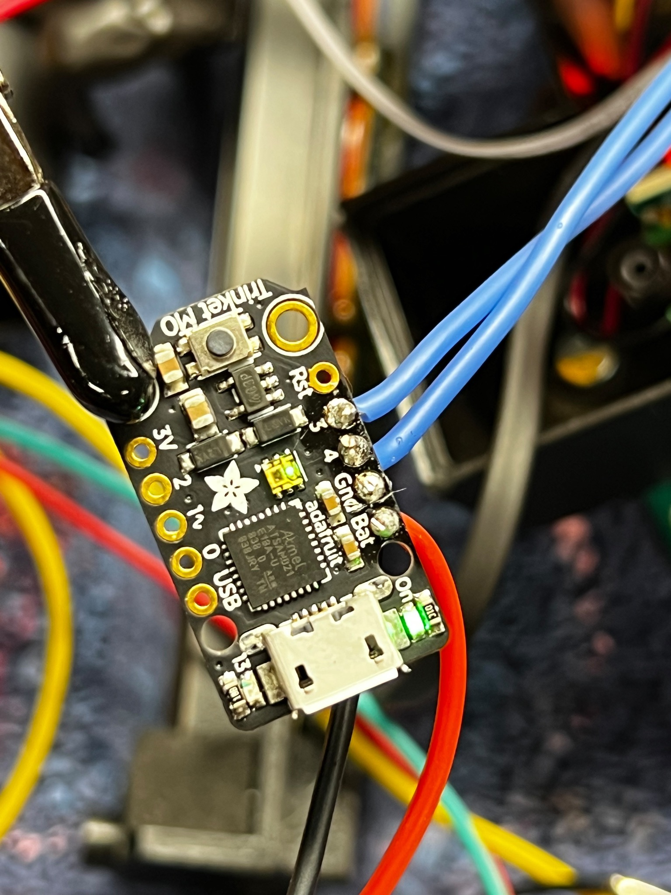
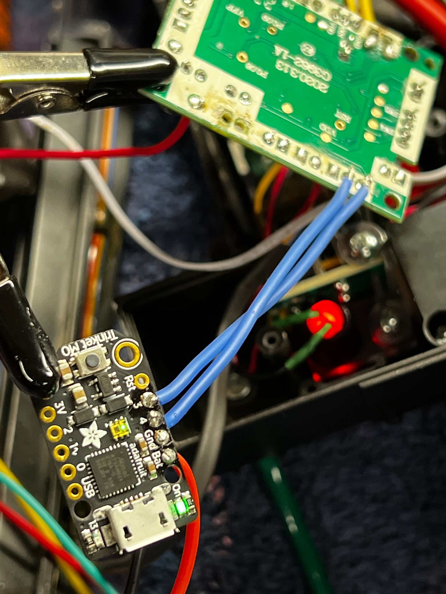

# Spengler Wand Keepalive

This is a hardware mod to bypass the 30-second timeout for the HasLab Spengler Series Neutrona Wand. 

### Overview

Similar to other efforts, the only tried-and-true means so far to keep the Neutrona Wand running beyond 30 seconds of inactivity is to physically trick it into thinking there has been some interaction with the device. The downside to most solutions so far impacts the behavior of the wand or those solutions may trigger an accompanying audio clip as part of the triggered action. This solution is completely silent in operation, does not impede or alter the behavior of the wand, and (so far) appears to avoid the de-powering for at least 3 full minutes of being left idle.

The trick used for this solution is to alternate a positive voltage (a short) to 2 pins which are tied to the rotary encoder which affects the intensity of the wand. This is the part of the electronics tied to the dial on the top of the wand near the vent. Applying voltage to just one of the pins was found to be insufficient, but by alternating a brief short to the A/B signal pins the wand could be kept alive beyond the default idle timeout period. This is accomplished by use of a small microcontroller board which is soldered to the pins and performs the necessary actions every X seconds.

### Disclaimer

This has been performed on the MK2 wand (shipped late 2022) and though not tested on the original MK1 it is assumed to behave in the same way since both wand models are claimed to work with the Hasbro Spengler Series Proton Pack. It should be stated that this does not (yet) defeat the 200-second timeout on the pack, though bench tests have shown that my pack could remain running for up to 20 minutes without interactions in some cases. YMMV, but it's at least something better than what we got.

Additionally, this mod requires additional power to be provided to the wand. The first successful mod for a keepalive used the power supplied directly from the pack though it alters the behavior to some degree and required multiple microcontrols. To avoid triggering an unexpected power-up of the pack we need to avoid this by sending power directly to the wand for our microcontroller.

## Prerequisites

This mod will require some actions which may not be applicable or favorable to everyone, so let's cover some skills and materials which will be required.

### Skills

1. Mechanical Skills - Access into your Neutrona Wand is required and will involve removing some plastic plugs before the screws are accessible.
1. Soldering Skills - You will need to make some attachments to the TrinketM0 board and the wand controller. If this is not your forte then you may want to avoid going further.

### Materials

1. [Adafruit TrinketM0](https://www.adafruit.com/product/3500) - This low-power controller board uses CircuitPython code to execute the necessary actions. You are not limited to this controller, but all supplied code and instructions are meant to use this for the solution.
1. [Hookup Wire](https://a.co/bsQkHiy) - You'll need to connect in some confined spaces, and this wire is absolutely fantastic for that. The silicone covering makes it infinitely bendable, while 22AWG is perfectly thick enough for good contact.
1. [Soldering Iron](https://a.co/9bSmH8N) - These devices have come a long way from the "plug-in and wait to heat" models of old. This device heats up near instantly and is a joy to use if you've not yet modernized your electronics equipment.
1. [Helping Hands](https://a.co/avDRwko) - You will definitely want some help with soldering and holding the controller out of the way. The factory-attached wires are delicate and excessive movement can break them at their solder joint, so the less you have to move the controller the better.
1. [Better Battery](https://a.co/hqk2DC1) - It is assumed that if you plan to run your pack longer then you'll need a better battery. The most popular modification for most users is to add a TalentCell or other similar rechargeable battery as the main power source. This will not be coverd as part of this mod but is strongly encouraged to proceed using any available guides as you'll need to provide additional power to the new microcontroller to be installed in the wand.

**Optional:**

[6-Pin Plug](https://a.co/bmi4JxW) - As noted, this mod requires additional power to the wand for the microcontroller but we should also plan for other potential mods such as audio-return from the wand. If you wish to keep everything self-contained and plan to replace your stock connection hose (or at least the wires inside of it) and you will need 3 pairs (6 total) of wires for the most common mods:

  - Two (2) pairs for normal power from the U7 port on the pack controller for the wand's normal integration.
  - Two (2) pairs for new power to our microcontroller and any other devices which we may want to run without triggering the pack power-up.
  - Two (2) pairs for audio to be returned to the pack to play the thrower sounds on amplified speakers.

Alternatively, you could run your new power and an aux audio cable on the outside of the wand as some pack owners have done, which is close to the Afterlife style of decorating the pack. How you choose to get power to the wand is entirely up to you though we will definitely need it.

## Warnings

1. This will void the warranty for your pack and wand. Do not proceed if you wish to remain "stock" or reversible.
1. This could potentially damage your controller board(s). The fact that it works does not establish long-term viability or safety from unforseen issues.
1. There will be significant work to gain access to your wand internals. Do not proceed if your skills with a power drill are lacking.

## Credits

Shout out to user [gpstar](https://www.gbfans.com/forum/memberlist.php?mode=viewprofile&u=58705) on the GBFans.com forum for the tremendous legwork investigating the capabilities of the Hasbro equipment before many of us had packs in our hands.

## Instructions

Before proceeding we need to open the wand and identify some parts. For gaining access to the internals its encouraged to [follow this video guide](https://www.youtube.com/watch?v=L5mvL23-lus) which involves drilling out the plastic screw plug covers, allowing the screws to be removed for the mounting plate and bottom cover of the wand's gunbox.

We should also pre-load the software onto the microcontroller. Using a good micro-USB cable (which supports data as well as power) connect the TrinketM0 to your computer. Copy the contents inside of the "TrinketM0" folder onto a USB drive named "CIRCUITPY". Once everything is copied the microcontroller is ready for use.

For power, we can split off of the 5VDC power going to the pack controller. For consistency these wires should be red and black in color. Meanwhile, our other wires can be any color you wish, just not red or black.

* Solder red, positive (+5V) to the hole labelled "Bat" on the TrinketM0.
* Solder black, negative (-) to the hole labelled "Gnd" on the TrinketM0.
* Solder a 3-5" wire to the hold labelled "3" (use any color other than red or black).
* Solder a 3-5" wire to the hold labelled "4" (use any color other than red or black).

We now need to identify the wires which are soldered directly to an area labelled "SW3" on the wand controller. These wires are Brown, Red, and Yellow and represent the positive voltage, A signal, and B signal respectively. (Essentially, when a rotary encoder is turned there is a pulse sent back to the controller on either the A or B signal lines indicating which direction the encoder was turned.)

For the connection to the controller we need will attach to the backside of the Red and Yellow wires of SW3 identified earlier. Use your "helping hands" to hold the controller board and each of the wires close to their destination. Pre-tin the wires to make this easier (cover them in a bit of molten solder) to make it easier to connect. A brief touch with the soldering iron to melt the tinned wires to the existing solder joint without causing the original wires to come loose.

* Solder the wire from pin "3" to the backside of the Yellow wire (closest to the screw hole).
* Solder the wire from pin "4" to the backside of the Red wire (just beside our previous attachment).

## Testing

Once the connections are made, we can power up the pack and our microcontroller. There should be 2 green LED's lit on the device: the top corner indicates the device is booted while the central LED will alternate from green (good startup) to red then blue as actions are performed. Note that whenever the pack is powered up, so is the microcontroller. At this point you can power up the wand and confirm normal operations. If everything worked as expected you should now get more than 30 seconds of idle runtime without the wand powering down.