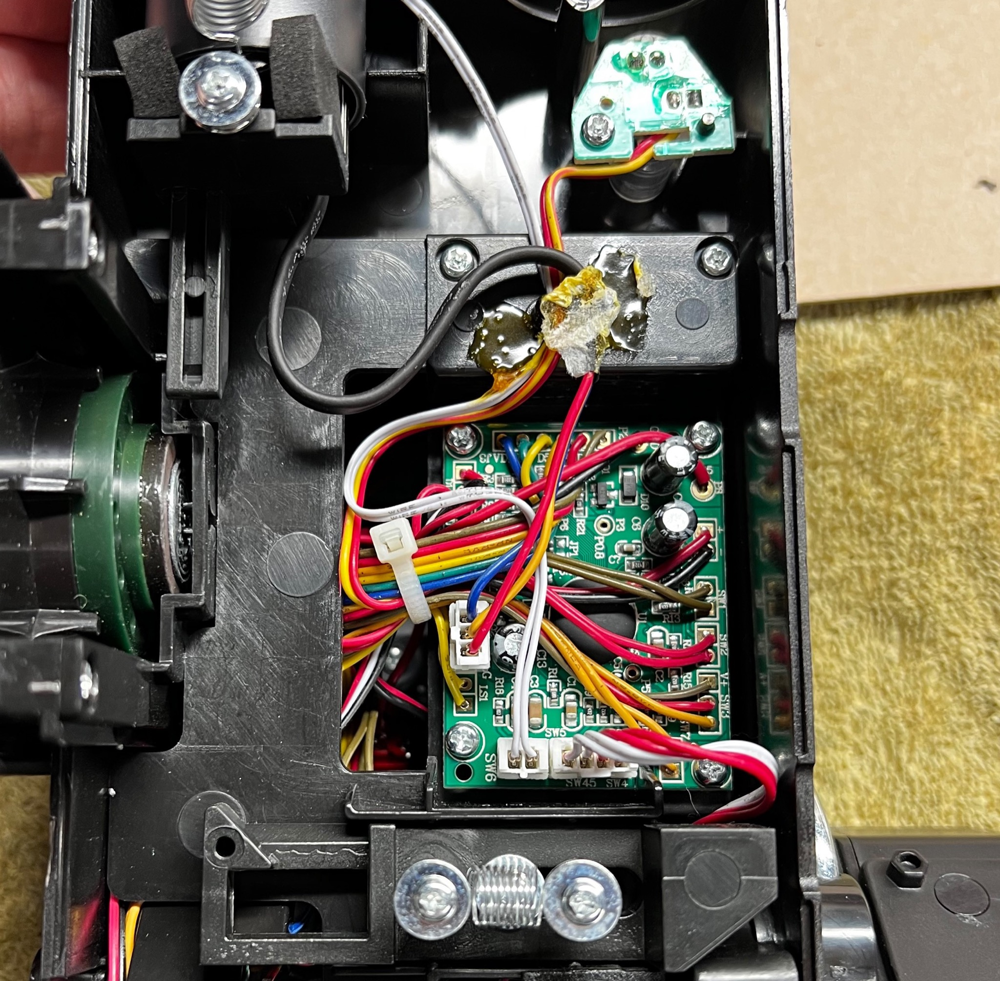

# Spengler Wand Keepalive

This is a hardware modification (mod) to bypass the 30-second timeout for the HasLab Spengler Series Neutrona Wand. 

### Overview

Similar to other documented efforts, the only successful means so far to keep the Neutrona Wand running beyond 30 seconds of inactivity is to physically trick it into thinking there has been some interaction with the device. This solution is mostly unobservable when in operation, avoids triggering the startup of the pack, does not impede normal behavior of the wand, and (so far) appears to avoid the de-powering for at least 3 full minutes of being left idle (essentially the idle time limit of the Proton Pack).

The trick used for this solution is to alternate a positive voltage (a short) to 2 pins which are tied to the rotary encoder which adjusts the intensity of the wand. (The encoder is the part of the electronics tied to the dial on the top of the wand near the vent.) Applying voltage to just one of the pins is insufficient, but by alternating a brief short-circuit to 2 signal pins the wand could be kept alive beyond the default idle timeout period. The net result is to mimic turning the knob on the top of the wand so that it increased then decreases intensity by 1 as indicated by the LED's in the bargraph. This is accomplished by use of a small microcontroller board which is soldered to the pins and performs the necessary actions every 5 seconds.

The only side-effect of this particular "hack" is that you will hear the intensity gently ramp up slightly then back down every few seconds as part of the emulation of user interactions. And the one requirement during normal use is that the wand must be powered up along with the bargraph (both toggle switches on the right are in the "up" position).

### Disclaimer

This has been performed on the MK2 wand (shipped in late 2022) though not tested on the original MK1, but is assumed to behave in the same way since both wand models are claimed to work with the Hasbro Spengler Series Proton Pack. It should be stated that this does not (yet) defeat the 200-second timeout on the pack, though bench tests have shown that my pack could remain running for up to 20 minutes without interactions in some cases. YMMV, but it's at least something better than what we got.

It should be stated this mod requires additional power to be provided to the wand for the additional microcontroller. The first successful mod for a keepalive used the power which was supplied directly from the pack, although it alters the behavior to some degree and requires multiple microcontrols. To avoid triggering an unexpected power-up of the pack we need to avoid this by sending power directly to the wand for our implementation.

## Prerequisites

This mod will require some actions which may not be suitable or favorable to everyone so let's cover some skills and materials which will be expected:

### Skills

1. Mechanical Skills - Access into your Neutrona Wand is required and will involve removing some plastic plugs before the screws are accessible. This is more involved than accessing the internals of the Proton Pack.
1. Soldering Skills - You will need to make some attachments to the microcontroller board and the stock wand controller. If this is not your preference then you may want to avoid going any further.

### Materials

1. [Adafruit TrinketM0](https://www.adafruit.com/product/3500) - This low-power controller board uses CircuitPython code to execute the necessary actions. You are not limited to this controller, but all supplied code and instructions are meant to use this for the solution.
1. [Hookup Wire](https://a.co/bsQkHiy) - You'll need to connect in some confined spaces, and this wire is great for that purpose. The silicone covering makes it extremely bendable, while the stranded 22AWG wire is perfectly thick enough for good contact.
1. [Soldering Iron](https://a.co/9bSmH8N) - These devices have come a long way from the "plug-in and wait to heat" models of old. This device heats up near instantly and is a joy to use if you've not yet modernized your electronics equipment. If you already own a soldering iron and are comfortable with it then there is no need to buy this particular model
1. [Helping Hands](https://a.co/avDRwko) - You will definitely want some help with soldering and holding the controller out of the way. The factory-attached wires are delicate and excessive movement can break them at their solder joint, so the less you have to move the controller the better. Any similar device with 2-4 arms should be fine.
1. [Better Battery](https://a.co/hqk2DC1) - It is assumed that if you plan to run your pack longer then you'll need a better battery. The most popular modification for users is to add a TalentCell or similar rechargeable battery as the main power source. _This task will not be covered as part of this mod but is strongly encouraged to implement using any available guides since you'll need to provide additional power to the new microcontroller to be installed in the wand._

**Optional:**

[6-Pin Plug](https://a.co/bmi4JxW) - As noted, this mod requires additional power to the wand for the microcontroller but this is an opportunity to plan for other potential mods such as audio-return from the wand to the pack. If you wish to keep everything self-contained and plan to replace your stock connection hose (or at least the wires inside of it) then you will want at least 3 pairs (6 total) of wires for the most common mods:

  - Two (2) pairs for normal power from the U7 port on the pack controller for the wand's normal integration (triggers the pack on/off).
  - Two (2) pairs for new power to our microcontroller and any other devices which we may want to run without triggering the pack power-up.
    - Note that as the community works towards better upgrades to the electronics, these 2 wires may be reused for TX/RX signals between the wand and pack. Hence, adding them now for additional power means they're available for re-use later should a better solution come available.
  - Two (2) pairs for audio to be returned to the pack to play the thrower sounds on amplified speakers (again, optional but popular).

Alternatively, you could run your new power and an aux audio cable on the outside of the wand as some pack owners have done, which is close to the Afterlife style of decorating the pack. How you choose to get power to the wand is entirely up to you though we will definitely need it.

## Warnings

1. This will void the warranty for your pack and wand. Do not proceed if you wish to remain "stock" or reversible.
1. This could potentially damage your controller board(s). The fact that it works does not establish long-term viability or safety from unforseen issues.
1. There will be significant work to gain access to your wand internals. Do not proceed if your skills with a power drill are lacking.

## Credits

Shout out to user [gpstar](https://www.gbfans.com/forum/memberlist.php?mode=viewprofile&u=58705) on the GBFans.com forum for the tremendous legwork investigating the capabilities of the Hasbro equipment before many of us had packs in our hands. The work to examine and document the stock controllers and for coming up with [the first major keepalive hack](https://www.gbfans.com/forum/viewtopic.php?t=50438) was outstanding and continues to deliver.

## Instructions

Before proceeding we need to open the wand and identify some parts. For gaining access to the internals its encouraged to [follow this video guide](https://www.youtube.com/watch?v=L5mvL23-lus) which involves drilling out the plastic screw plug covers, allowing the screws to be removed for the mounting plate and bottom cover of the wand's gunbox.

First, we should also pre-load the software onto the microcontroller.

1. Using a good micro-USB cable (which supports data as well as power) connect the TrinketM0 to your computer.
1. Copy the contents inside of the "TrinketM0" folder onto a USB drive named "CIRCUITPY".
1. Once everything is copied the microcontroller is ready for use and can be disconnected.

Next, we need power. We can split off of the 5VDC power going to the pack controller if you've already opened your pack or added an external battery. For consistency these wires should be red and black in color and match up with the original power supply for the pack controller. Meanwhile, our other control wires can be any color you wish (just not red or black). Remember, how you get this power to your wand is up to you--as you could replace the stock hose and wiring entirely or add these as both functional and decorative wires to the outside of the wand as done in the Afterlife style.

1. Solder red/positive (max +5V) to the hole labelled "Bat" on the TrinketM0.
1. Solder black/negative to the hole labelled "Gnd" on the TrinketM0.
1. Solder a 3-5" wire to the hold labelled "3" (use any color other than red or black).
1. Solder a 3-5" wire to the hold labelled "4" (use any color other than red or black).

We now need to identify the wires which are soldered directly to an area labelled "SW3" on the wand controller. For reference this will be at the corner of the controller close to the release lever on the side of the gunbox. The wires we want are in the SW3 labelled area, are Brown, Red, and Yellow, and they represent the positive voltage (V+), A signal, and B signal respectively. (Essentially, when a rotary encoder is turned there is a pulse sent back to the controller on the A and B signal lines indicating which direction it was turned.)

Lastly, for the connection to the controller we need will attach to the backside of the Red and Yellow wires of SW3 identified earlier.

1. Unscrew the 4 small screws holding the controller down in the gunbox.
1. Carefully move any wires out of the way as you flip the board upside down.
1. Use your "helping hands" to hold the controller board and each of the wires close to their destination.
1. Pre-tin the wires to make this easier (cover them in a bit of molten solder) to make it easier to connect.
1. Use a brief touch with the soldering iron, just enough to melt the tinned wires to the existing solder joint without causing the original wires to come loose. The order of these should not be important but for sake of consistency:
	* Solder the wire from pin "3" to the backside of the Yellow wire (closest to the screw hole).
	* Solder the wire from pin "4" to the backside of the Red wire (just beside our previous attachment).

## Testing

Once the connections are made, we can power up the pack and our microcontroller by turning on the battery and flipping the switch under the ion arm. There should be 2 green LED's lit on the device for confirmation: the top corner indicates the device is powered and booted while the central LED will alternate from green (good startup) to red then blue as actions are performed. Note that whenever the pack is powered up so is the microcontroller, even if the wand is not powered up yet. At this point you can power up the wand and confirm normal operations. If everything worked as expected you should now get more than 30 seconds of idle runtime without the wand powering down.

If all is well, carefully re-secure the controller in it's normal location, make sure no wires interfere with the locking of the wand tip, and reassemble the gun box and mounting plate to the wand. You're done!

## Feedback and Contributions

Feel free to fork this project and submit a pull request for any improvements you may discover. To set proper expectations, I do not plan to actively maintain or improve this solution as I feel the community will develop better solutions around these products with more features. And given the limitations of the stock controllers I do intend to upgrade all of the electronics when such an option becomes available.